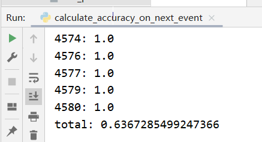

## 1. 摘要

###### 主要讲论文简介，阐述工作内容，创新点，效果

works:

First, we show that LSTMs outperform existing techniques to predict the next event of a running case and its timestamp.

Next, we show how to use models for predicting the next task in order to predict the full continuation of a running case.

Finally, we apply the same approach to predict the remaining time, and show that this approach **outperforms** existing tailor-made methods.

1. 说明在根据时间序列预测领域LSTM比其他好
2. 如何处理数据，构造预测模型
3. 对比评测，证明该预测方法优于其他方法


## 2. 引言部分 

###### 介绍研究背景，研究意义，发展历程，提出问题

1. 研究背景：根据时间序列预测是一件很有价值的事情：应用-避免损失，增加收益，提前安排。
2. 研究意义：现有方法都是基于数据集设计，无法移植，生产成本高。
3. 发展历程：没怎么讲，主要提到模型单个和组合的使用，然后提到，neural networks with Long Short-Term Memory (LSTM) architectures have been shown to deliver consistently high accuracy in several sequence modeling application domains（发现LSTM在时间序列预测领域LSTM比其他好）。
4. 提出问题：
  1. can LSTMs be applied to a broad range of predictive process monitoring problems, and how?
  2. do LSTMs achieve consistently high accuracy across a range of prediction tasks, event logs and prediction points?
5. To address these questions, the paper puts forward LSTM architectures for predicting（输出——预测对象）:
  1. the next activity in a running case and its timestamp;（case number，任务分类）
  2. the continuation of a case up to completion;
  3. the remaining cycle time.


## 3. 相关工作

###### 相关研究算法简介，分析存在的缺点

1.  time-related predictions:
  1. A range of research proposals - predicting **delays and deadline violations** in business processes:
        1. Pika et al. propose a technique for predicting deadline violations.
            2. Metzger et al. present techniques for predicting “late show” events (i.e. delays between the expected and the actual time of arrival) in a freight transportation process.
                3. Senderovich et al. apply queue mining techniques to predict delays in case executions.
  2. Another body of work focuses on predicting the **remaining cycle time of running cases**:
        1. Van Dongen et al. predict the remaining time by using nonparametric regression models based on case variables. 
            2. van der Aalst et al. Predictive Business Process Monitoring with LSTM Neural Networks 479 propose a remaining time prediction method by constructing a transition system from the event log using set, bag, or sequence abstractions.
                3. Rogge-Solti and Weske use stochastic Petri nets to predict the remaining time of a process, taking into account elapsed time since the last observed event.
                    4. Folino et al. develop an ad-hoc clustering approach to predict remaining time and overtime faults.
  3. In this paper:
        1. we show that prediction of the remaining cycle time can be approached as a special case of prediction of a process continuation. Specifically, **our approach is proven to generally provide better accuracy than above 2-2, 2-3**.
2. predictions of the outcome of a case:
  1. Maggi et al. propose a framework to predict the outcome of a case (normal vs. deviant) based on the sequence of activities executed in a given case and the values of data attributes of the last executed activity in a case.
  2. De Leoni et al. propose a framework that classifies possible approaches to extract such feature vectors.
  3. In this paper:
        1. we do not address the problem of case outcome prediction, although the proposed architectures could be extended in this direction.（没做，但可以扩展，画大饼）
3. predictions of the continuation of a case and/or characteristics thereof:
  1. Breuker et al. use probabilistic finite automaton to tackle the next-activity prediction problem, while Evermann et al. use LSTMs.
  2. Pravilovic et al. propose an approach that predicts both the next activity and its attributes (e.g. the involved resource).
  3. Lakshmanan et al. use Markov chains to estimate the probability of future execution of a given task in a running case.
  4. Van der Spoel et al. address the more ambitious problem of predicting the entire continuation of a case using a shortest path algorithm over a causality graph.
  5. Polato et al. refine this approach by mining an annotated transition system from an event log and annotating its edges with transition probabilities.  
  6. In this paper：
        1. we **use LSTMs** to tackle predicting the next activity and its timestamp.（实现2）
            2. we take this latter approach（5） as a baseline and show how LSTMs can improve over it while providing higher generalizability.（把5作为基线）


## 5. 核心内容

###### 本文工作论文主要方法，实现细节

下文针对helpdesk数据集进行阐述。


### 5.1 实验部分

#### 5.1.1 数据处理

##### 5.1.1.1 数据集处理

helpdesk.csv数据集说明：

```
1. CaseID: 按行不减，下一行比上一行+0/+1；caseID相同代表同一个case下的多个时间戳
2. ActivityID: 活动类型，integer；每行只有一个合法的integer
3. CompleteTimestamp: 完成时间戳，格式为2012-04-03 16:55:38
```

思路：以相同caseID的rows作为一组数据，进行这一组数据的提取

提取对象：

```
# 中间处理，都为同一个case下
time: 当前与前一个的时间差，case的第一个为0
time2: 当前和第一个的时间差
time3: 当前与24点的时间差
time4: 当前的星期数
```

```
# 最终处理
lines = []  # these are all the activity seq -> (ActivityID+offest)[]
timeSeqs = []   # time sequences (differences between two events) -> time[]
timeSeqs2 = []  # time sequences (differences between the current and first) -> time2[]
timeSeqs3 = []  # time sequences (differences between the current and 24:00) -> time3[]
timeSeqs4 = []  # time sequences (weekday) -> time4[]
```

##### 5.1.1.2 计算综合信息

首先是计算divisor，直接拿平均值算timeSeqs1-4

```
# average time 
divisor = np.mean([item for sublist in timeSeqs for item in sublist])
divisor2 = np.mean([item for sublist in timeSeqs2 for item in sublist])
divisor3 = np.mean([item for sublist in timeSeqs3 for item in sublist])
divisor4 = np.mean([item for sublist in timeSeqs4 for item in sublist])
```

然后确定folds，平均分为三份：

```
# separate training data into 3 parts
elems_per_fold = int(round(numLines/3))

# fold1--------------------------------
fold1 = lines[:elems_per_fold]
fold1_t = timeSeqs[:elems_per_fold]
fold1_t2 = timeSeqs2[:elems_per_fold]
fold1_t3 = timeSeqs3[:elems_per_fold]
fold1_t4 = timeSeqs4[:elems_per_fold]

# fold2--------------------------------
...

# fold3--------------------------------
...
```

因为lines里面的数据加了offest，所以我们对这些ActivityID进行映射，并处理出来list和dict

```
chars: ['¢', '£', '¤', '¥', '¦', '§', '¨', '©', 'ª'] # 要分析的符号
target_chars: ['!', '¢', '£', '¤', '¥', '¦', '§', '¨', '©', 'ª'] # 全部符号，比上面多'!'
char_indices: {'¢': 0, '£': 1, '¤': 2, '¥': 3, '¦': 4, '§': 5, '¨': 6, '©': 7, 'ª': 8}
indices_char: {0: '¢', 1: '£', 2: '¤', 3: '¥', 4: '¦', 5: '§', 6: '¨', 7: '©', 8: 'ª'}
target_char_indices: {'!': 0, '¢': 1, '£': 2, '¤': 3, '¥': 4, '¦': 5, '§': 6, '¨': 7, '©': 8, 'ª': 9}
target_indices_char: {0: '!', 1: '¢', 2: '£', 3: '¤', 4: '¥', 5: '¦', 6: '§', 7: '¨', 8: '©', 9: 'ª'}
```

把数据集前2/3作为训练集，初步处理一些特征，case开始到当前的ActivityID序列，next time1-4属性

```
# leave away fold3 for now
lines = fold1 + fold2
lines_t = fold1_t + fold2_t
lines_t2 = fold1_t2 + fold2_t2
lines_t3 = fold1_t3 + fold2_t3
lines_t4 = fold1_t4 + fold2_t4

# generate sentences and chars for model train---------------------------------
sentences = [] # line[i] -> line[0:i]
sentences_t = [] # line_t[i] -> line_t[0:i]
sentences_t2 = [] # line_t2[i] -> line_t2[0:i]
sentences_t3 = [] # line_t3[i] -> line_t3[0:i]
sentences_t4 = [] # line_t4[i] -> line_t4[0:i]
next_chars = [] # line_t[i]
next_chars_t = [] # last one: 0; else: line_t[i]
next_chars_t2 = [] # last one: 0; else: line_t2[i]
next_chars_t3 = [] # last one: 0; else: line_t3[i]
next_chars_t4 = [] # last one: 0; else: line_t4[i]
```

最后生成要放入模型的训练数据，生成特征向量和标签

```
num_features = len(chars)+5
X = np.zeros((len(sentences), maxLen, num_features), dtype=np.float32)
y_a = np.zeros((len(sentences), len(target_chars)), dtype=np.float32)
y_t = np.zeros((len(sentences)), dtype=np.float32)
```

这里套用chat_gpt的回答：

1. 首先，代码创建了三个数组 `X`、`y_a` 和 `y_t`，它们分别用来存储特征向量和标签。数组 `X` 的形状为 `(len(sentences), maxLen, num_features)`，其中 `len(sentences)` 表示句子的数量，`maxLen` 表示最大句子长度，`num_features` 表示特征的数量。数组 `y_a` 的形状为 `(len(sentences), len(target_chars))`，表示每个句子的目标字符的 one-hot 编码。数组 `y_t` 的形状为 `(len(sentences),)`，表示每个句子的目标时间除以某个除数。

2. 接下来，代码使用嵌套的循环遍历每个句子和对应的字符。在循环中，首先计算句子的左填充长度(`leftpad`)，然后将句子的字符按照索引存储到 `X` 中的相应位置。具体而言：

	- 对于字符 `char`，将其编码到特征向量 `X[i, t+leftpad, char_indices[c]]` 的对应位置。其中，`i` 表示第 `i` 个句子，`t` 表示字符的索引，`leftpad` 表示左填充长度，`char_indices[c]` 表示字符 `c` 在特征向量中的索引位置。

	- 将字符所在的时间步长加1编码到 `X[i, t+leftpad, len(chars)]` 的位置。该位置是用于表示字符所处时间步长的特征。

	- 将字符的时间特征进行归一化处理后编码到 `X[i, t+leftpad, len(chars)+1]` 的位置。其中，`sentence_t[t]/divisor` 表示字符的时间特征除以一个除数 `divisor` 进行归一化处理后的值。

	- 将字符的其他时间特征进行类似的操作编码到对应位置。

3. 接着，代码使用嵌套的循环遍历目标字符和目标时间。根据目标字符和当前字符是否相等，将合适的值赋给 `y_a` 数组中的相应位置。具体而言：

	- 如果目标字符和当前字符相等，则在 `y_a[i, target_char_indices[c]]` 的位置上赋值为 `1-softness`，表示当前字符为目标字符的概率。

	- 如果目标字符和当前字符不相等，则在 `y_a[i, target_char_indices[c]]` 的位置上赋值为 `softness/(len(target_chars)-1)`，表示当前字符不是目标字符的概率。

4. 最后，将目标时间除以除数 `divisor` 后赋值给 `y_t[i]`，表示目标时间的归一化值。

#### 5.1.2 模型构建与训练

##### 5.1.2.1 模型构建

```
# build the model:
print('Build model...')
main_input = Input(shape=(maxLen, num_features), name='main_input')

# train a 2-layer LSTM with one shared layer
# 共享层，接收外部输入，奠定STLM，并规范化输出
l1 = LSTM(100, implementation=2, kernel_initializer='glorot_uniform', return_sequences=True, dropout=0.2)(main_input)
b1 = BatchNormalization()(l1)
# ---- units 100，即 LSTM 单元的数量或输出维度
# ---- implementation 使用的是优选的 CuDNN 加速实现
# ---- kernel_initializer 使用的是 Glorot 均匀分布初始化方法
# ---- return_sequences 设置为 True 表示该层返回完整的输出序列（与输入序列长度相同）
# ---- 20% 的 Dropout

# the layer specialized in activity prediction
# 输入b1，输出预测activity
l2_1 = LSTM(100, implementation=2, kernel_initializer='glorot_uniform', return_sequences=False, dropout=0.2)(b1)
b2_1 = BatchNormalization()(l2_1)

# the layer specialized in time prediction
# 输入b1，输出预测time
l2_2 = LSTM(100, implementation=2, kernel_initializer='glorot_uniform', return_sequences=False, dropout=0.2)(b1)
b2_2 = BatchNormalization()(l2_2)

# 输入b2_1，输出预测的activity
act_output = Dense(len(target_chars), activation='softmax', kernel_initializer='glorot_uniform', name='act_output')(b2_1)
# 输入b2_2，输出预测的time
time_output = Dense(1, kernel_initializer='glorot_uniform', name='time_output')(b2_2)

# 整合model
model = Model(inputs=[main_input], outputs=[act_output, time_output])
```

首先，代码定义了输入层 `main_input`，其形状为 `(maxLen, num_features)`，其中 `maxLen` 表示句子的最大长度，`num_features` 表示特征的数量。

接下来，定义了两个 LSTM 层。第一个 LSTM 层 `l1` 是一个共享层，它接受输入层作为输入，并使用 `return_sequences=True` 参数返回序列输出。第二个 LSTM 层 `l2_1` 和 `l2_2` 分别用于活动预测和时间预测。它们都接收第一个 LSTM 层的输出，并返回最后一个时间步的输出。

在每个 LSTM 层后面，代码添加了一个 BatchNormalization 层 `b1` 和 `b2_1`、`b2_2`，以规范化输出。

之后，分别定义了两个输出层。`act_output` 是一个具有 `softmax` 激活函数的全连接层，用于对目标字符进行分类预测。`time_output` 是一个无激活函数的全连接层，用于对目标时间进行回归预测。

接下来，通过将输入层和输出层传递给 `Model` 类，实例化了一个模型对象 `model`。

##### 5.1.2.2 模型训练

```
# 开始炼丹
opt = tf.keras.optimizers.Nadam(learning_rate=0.002, beta_1=0.9, beta_2=0.999, epsilon=1e-08, clipvalue=3)

model.compile(loss={'act_output':'categorical_crossentropy', 'time_output':'mae'}, optimizer=opt)
early_stopping = EarlyStopping(monitor='val_loss', patience=50)
model_checkpoint = ModelCheckpoint('output_files/models/model_{epoch:02d}-{val_loss:.2f}.h5', monitor='val_loss', verbose=0, save_best_only=True, save_weights_only=False, mode='auto')
lr_reducer = ReduceLROnPlateau(monitor='val_loss', factor=0.5, patience=10, verbose=0, mode='auto', min_delta=0.0001, cooldown=0, min_lr=0)

model.fit(X, {'act_output':y_a, 'time_output':y_t}, validation_split=0.2, verbose=2, callbacks=[early_stopping, model_checkpoint, lr_reducer], batch_size=maxLen, epochs=500)
```

在模型编译阶段，使用 `model.compile` 方法定义了损失函数和优化器。损失函数包括 `categorical_crossentropy` 和 `mae`（平均绝对误差），分别用于分类任务和回归任务。优化器选用了 Nadam 优化器，其中包含学习率、梯度衰减等参数设置。

在模型训练阶段，使用 `model.fit` 方法传入特征向量 `X` 和标签 `y_a`、`y_t` 进行训练。其中，验证集的比例为 20%。通过设置 `verbose=2` 可以获得更详细的训练进度信息。此外，还使用了一些回调函数，如 EarlyStopping、ModelCheckpoint 和 ReduceLROnPlateau，用于提前停止训练、保存最好的模型权重和动态调整学习率。

#### 5.1.3 评估策略

两个步骤：

1. 调model预测处理后的数据，拿后1/3作为验证集，输出预测结果

	```
	"CaseID", "Prefix length", "Groud truth", "Predicted", "Levenshtein", "Damerau", "Jaccard", "Ground truth times", "Predicted times", "RMSE", "MAE"
	```

2. 拿预测结果处理，（预测结果已经根据不同前缀长度生成了答案和预测值）；直接展示准确率——根据预测结果设为0或1，然后确定这个case每个点的预测结果，和除以长度，得出case的预测准确率

### 5.2 结论部分

直接看他的实验结果，LSTM的效果确实比较好。

但是我跑出来的评测结果似乎和他的不太一样，估计是我训练的时候坏参数改坏了，下面是总的：



优越性主要体现在：

1. 准确率可靠，相比其他有小幅提升
2. 成本低，神经元数量小
3. 可扩展性，可移植性高


## 6. 思考

  一直在思考一个比较抽象的问题：如果一定要用sigmoid作为基本拟合单元的话，为什么时间序列不尝试使用一些三角函数这种周期性强的单元进行拟合来构造底层模型